# GenAI Gateway - 🧪 [Azure API Management](https://learn.microsoft.com/en-us/azure/api-management/api-management-key-concepts) で構築する [GenAI Gateway が提供する価値](https://techcommunity.microsoft.com/t5/azure-integration-services-blog/introducing-genai-gateway-capabilities-in-azure-api-management/ba-p/4146525)

## コンテンツ

1. [🧠 GenAI Gateway](#-genai-gateway)
1. [🧪 Labs](#-labs)
1. [🚀 まず始めに](#-getting-started)
1. [🔨 ツール](#-tools)
1. [🏛️ Well-Architected Framework](#-well-architected-framework)    <!-- markdownlint-disable-line MD051 -->
1. [🥇 その他のリソース](#-other-resources)

AI の急速な進歩により、組織が業界の最前線に立ち続けるためには、実験主導のアプローチが求められています。AIがさまざまなセクターで着実にゲームチェンジャーになりつつある中、その潜在能力を最大限に引き出すことを目指す企業にとって、ペースの速いイノベーションの軌道を維持することは非常に重要です。

**AIサービス** は主に **API** を介してアクセスされるため、堅牢で効率的なAPI管理戦略が不可欠であることが浮き彫りになっています。この戦略は、**AI サービス** の消費に対する制御とガバナンスを維持するのに役立ちます。

**AI サービス** の視野が広がり、**API** とのシームレスな統合が進む中、API 管理の基本原則を広げる包括的な **AI ゲートウェイ** パターンに対する需要が高まっています。高度なユースケースの実験を加速し、この急速に進化する分野でのさらなるイノベーションへの道を開くことを目指しています。**AI ゲートウェイ** の適切に設計された原則は、**インテリジェント アプリ** を運用環境に自信を持ってデプロイするためのフレームワークを提供します。

## 🧠 GenAI Gateway

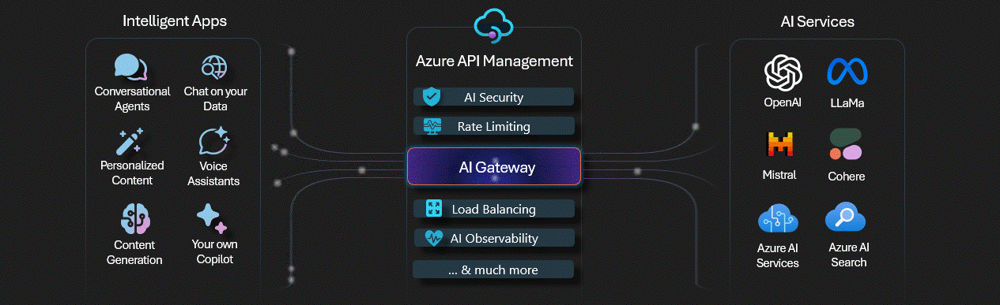

このリポジトリでは、一連の実験ラボを通じて **AI Gateway** パターンについて説明します。 [Azure API Management](https://learn.microsoft.com/en-us/azure/api-management/api-management-key-concepts) の [GenAI Gateway 機能](https://techcommunity.microsoft.com/t5/azure-integration-services-blog/introducing-genai-gateway-capabilities-in-azure-api-management/ba-p/4146525) は、これらのラボ内で重要な役割を果たし、セキュリティ、信頼性、パフォーマンス、全体的な運用効率、およびコスト管理がカバー範囲となります。 主な焦点は、大規模言語モデル (LLM) の標準リファレンスを設定する [Azure OpenAI](https://learn.microsoft.com/en-us/azure/ai-services/openai/overview) にあります。ただし、同じ原則と設計パターンを任意の LLM に適用できる可能性があります。

## 🧪 Labs
特に AI の領域で Python の優位性が高まっていることと、Jupyter Notebook の強力な実験機能を利用して構成されている次のラボは、Jupyter Notebook を中心に構成されており、Python スクリプト、[Bicep](https://learn.microsoft.com/en-us/azure/azure-resource-manager/bicep/overview?tabs=bicep) ファイル、[Azure API Management ポリシー](https://learn.microsoft.com/en-us/azure/api-management/api-management-howto-policies)が内包されています:

|  |  |
| -- | -- |
|  |  |
| [**🧪 Backend pool load balancing**](labs/backend-pool-load-balancing/backend-pool-load-balancing.ipynb) (built-in) | [**🧪 Advanced load balancing**](labs/advanced-load-balancing/advanced-load-balancing.ipynb) (custom) |
| [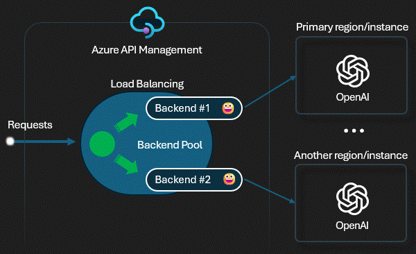](labs/backend-pool-load-balancing/backend-pool-load-balancing.ipynb) | [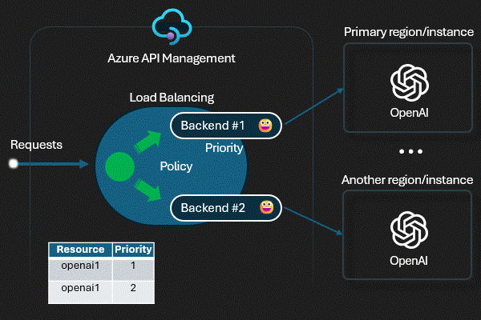](labs/advanced-load-balancing/advanced-load-balancing.ipynb) |
| 組み込みの負荷分散 [Azure API Management のバックエンド プール機能](https://learn.microsoft.com/en-us/azure/api-management/backends?tabs=bicep) を Azure OpenAI エンドポイントの一覧またはモック サーバーに対して試すためのプレイグラウンド。| Playground では、Azure OpenAI エンドポイントの一覧またはモック サーバーに対して (カスタム [Azure API Management ポリシー](https://learn.microsoft.com/en-us/azure/api-management/api-management-howto-policies) に基づく) 高度な負荷分散をお試しください。 |
| [🦾 Bicep](labs/backend-pool-load-balancing/main.bicep) ➕ [⚙️ Policy](labs/backend-pool-load-balancing/policy.xml) ➕ [🧾 Notebook](labs/backend-pool-load-balancing/backend-pool-load-balancing.ipynb) 🟰 [💬](../../issues/16 "Feedback loop discussion") | [🦾 Bicep](labs/advanced-load-balancing/main.bicep) ➕ [⚙️ Policy](labs/advanced-load-balancing/policy.xml) ➕ [🧾 Notebook](labs/advanced-load-balancing/advanced-load-balancing.ipynb) 🟰 [💬](../../issues/17 "Feedback loop discussion") |
|  |  |
|  |  |
| [**🧪 Access controlling**](labs/access-controlling/access-controlling.ipynb) | [**🧪 Token rate limiting**](labs/token-rate-limiting/token-rate-limiting.ipynb) |
| [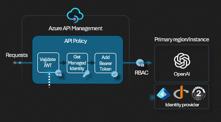](labs/access-controlling/access-controlling.ipynb) | [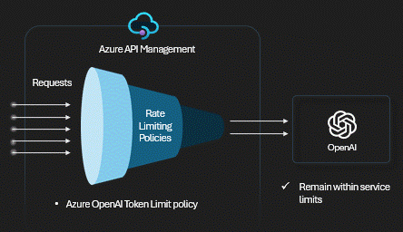](labs/token-rate-limiting/token-rate-limiting.ipynb) |
| Playground では、ID プロバイダーを使用して [OAuth 2.0 認証機能](https://learn.microsoft.com/en-us/azure/api-management/api-management-authenticate-authorize-azure-openai#oauth-20-authorization-using-identity-provider) を試し、特定のユーザーまたはクライアントによる OpenAPI API へのより詳細なアクセスを可能にします。  |  1 つ以上の Azure OpenAI エンドポイントに対して [トークン レート制限ポリシー](https://learn.microsoft.com/en-us/azure/api-management/azure-openai-token-limit-policy) を試すためのプレイグラウンド。トークンの使用量を超えると、呼び出し元は 429 を受け取ります。 |
| [🦾 Bicep](labs/access-controlling/main.bicep) ➕ [⚙️ Policy](labs/access-controlling/policy.xml) ➕ [🧾 Notebook](labs/access-controlling/access-controlling.ipynb) 🟰 [💬](../../issues/25 "Feedback loop discussion") | [🦾 Bicep](labs/token-rate-limiting/main.bicep) ➕ [⚙️ Policy](labs/token-rate-limiting/policy.xml) ➕ [🧾 Notebook](labs/token-rate-limiting/token-rate-limiting.ipynb) 🟰 [💬](../../issues/26 "Feedback loop discussion") |
|  |  |
|  |  |
| [**🧪 Token metrics emitting**](labs/token-metrics-emitting/token-metrics-emitting.ipynb) | [**🧪 Semantic caching**](labs/semantic-caching/semantic-caching.ipynb) |
| [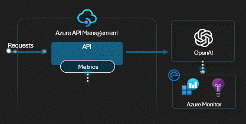](labs/token-metrics-emitting/token-metrics-emitting.ipynb) | [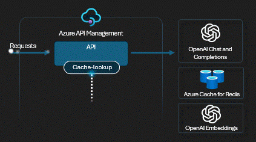](labs/semantic-caching/semantic-caching.ipynb) |
| [emit token metric policy](https://learn.microsoft.com/en-us/azure/api-management/azure-openai-emit-token-metric-policy) を試すためのプレイグラウンド。このポリシーは、Azure OpenAI Service API を介した大規模な言語モデル トークンの消費に関するメトリックを Application Insights に送信します。 | [セマンティックキャッシングポリシー](https://learn.microsoft.com/en-us/azure/api-management/azure-openai-semantic-cache-lookup-policy)を試すためのプレイグラウンド。プロンプトの以前の要求へのベクトル近接性と、指定された類似性スコアのしきい値を使用します。 |
| [🦾 Bicep](labs/token-metrics-emitting/main.bicep) ➕ [⚙️ Policy](labs/token-metrics-emitting/policy.xml) ➕ [🧾 Notebook](labs/token-metrics-emitting/token-metrics-emitting.ipynb) 🟰 [💬](../../issues/28 "Feedback loop discussion") | [🦾 Bicep](labs/semantic-caching/main.bicep) ➕ [⚙️ Policy](labs/semantic-caching/policy.xml) ➕ [🧾 Notebook](labs/semantic-caching/semantic-caching.ipynb) 🟰 [💬](../../issues/27 "Feedback loop discussion") |
|  |  |
|  |  |
| [**🧪 Response streaming**](labs/response-streaming/response-streaming.ipynb) | [**🧪 Vector searching**](labs/vector-searching/vector-searching.ipynb) |
| [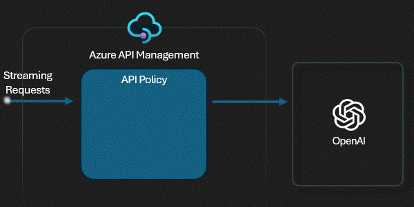](labs/response-streaming/response-streaming.ipynb) | [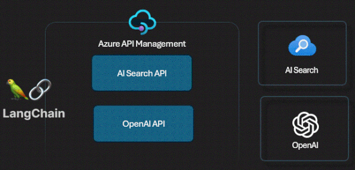](labs/vector-searching/vector-searching.ipynb) |
| Azure API Management と Azure OpenAI エンドポイントを使用して応答ストリーミングを試し、[ストリーミング](https://learn.microsoft.com/en-us/azure/api-management/how-to-server-sent-events#guidelines-for-sse) に関連する長所と短所を調べるためのプレイグラウンド。| Azure AI Search、Azure OpenAI 埋め込み、Azure OpenAI 補完を使用して [Retrieval Augmented Generation (RAG) pattern](https://learn.microsoft.com/en-us/azure/search/retrieval-augmented-generation-overview) を試すためのプレイグラウンド。 |
| [🦾 Bicep](labs/response-streaming/main.bicep) ➕ [⚙️ Policy](labs/response-streaming/policy.xml) ➕ [🧾 Notebook](labs/response-streaming/response-streaming.ipynb) 🟰 [💬](../../issues/18 "Feedback loop discussion") | [🦾 Bicep](labs/vector-searching/main.bicep) ➕ [⚙️ Policy](labs/vector-searching/policy.xml) ➕ [🧾 Notebook](labs/vector-searching/vector-searching.ipynb) 🟰 [💬](../../issues/19 "Feedback loop discussion") |
|  |  |
|  |  |
| [**🧪 Built-in logging**](labs/built-in-logging/built-in-logging.ipynb) | [**🧪 SLM self-hosting**](labs/slm-self-hosting/slm-self-hosting.ipynb) (phy-3) |
| [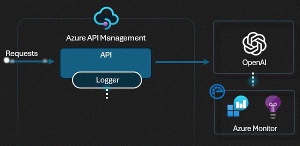](labs/built-in-logging/built-in-logging.ipynb) | [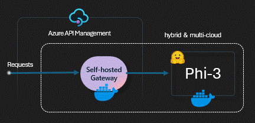](labs/slm-self-hosting/slm-self-hosting.ipynb) |
| [Azure API Managementの組み込みログ機能](https://learn.microsoft.com/en-us/azure/api-management/observability)を試すためのプレイグラウンド。App Insights に要求を記録して、詳細とトークンの使用状況を追跡します。 | OpenAI API と互換性がある [Azure API Management セルフホステッド ゲートウェイ](https://learn.microsoft.com/en-us/azure/api-management/self-hosted-gateway-overview) を通じて、セルフホステッド [phy-3 Small Language Model (SLM)](https://azure.microsoft.com/en-us/blog/introducing-phi-3-redefining-whats-possible-with-slms/) を試すためのプレイグラウンド。 |
| [🦾 Bicep](labs/built-in-logging/main.bicep) ➕ [⚙️ Policy](labs/built-in-logging/policy.xml) ➕ [🧾 Notebook](labs/built-in-logging/built-in-logging.ipynb) 🟰 [💬](../../issues/20 "Feedback loop discussion") | [🦾 Bicep](labs/slm-self-hosting/main.bicep) ➕ [⚙️ Policy](labs/slm-self-hosting/policy.xml) ➕ [🧾 Notebook](labs/slm-self-hosting/slm-self-hosting.ipynb) 🟰 [💬](../../issues/21 "Feedback loop discussion") |
|  |  |
|  |  |
| [**🧪 GPT-4o inferencing**](labs/GPT-4o-inferencing/GPT-4o-inferencing.ipynb) | [**🧪 Message storing**](labs/message-storing/message-storing.ipynb) |
| [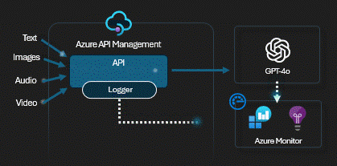](labs/GPT-4o-inferencing/GPT-4o-inferencing.ipynb)  | [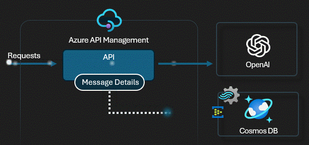](labs/message-storing/message-storing.ipynb) |
| 新しいGPT-4oモデルを試すための遊び場。GPT-4o(「オムニ」の「o」)は、テキスト、オーディオ、ビデオ入力の組み合わせを処理するように設計されており、テキスト、オーディオ、および画像形式で出力を生成できます。 | [Log to event hub](https://learn.microsoft.com/en-us/azure/api-management/log-to-eventhub-policy) ポリシーを使用して Cosmos DB にメッセージの詳細を格納するテストを行うためのプレイグラウンド。このポリシーを使用すると、DBに保存されるデータ(プロンプト、完了、モデル、リージョン、トークンなど)を制御できます。  |
| [🦾 Bicep](labs/GPT-4o-inferencing/main.bicep) ➕ [⚙️ Policy](labs/GPT-4o-inferencing/policy.xml) ➕ [🧾 Notebook](labs/GPT-4o-inferencing/GPT-4o-inferencing.ipynb) 🟰 [💬](../../issues/29 "Feedback loop discussion") | [🦾 Bicep](labs/message-storing/main.bicep) ➕ [⚙️ Policy](labs/message-storing/policy.xml) ➕ [🧾 Notebook](labs/message-storing/message-storing.ipynb) 🟰 [💬](../../issues/34 "Feedback loop discussion") |
|  |  |
|  |  |
| [**🧪 Developer tooling** (WIP)](labs/developer-tooling/developer-tooling.ipynb) | [**🧪 Function calling**](labs/function-calling/function-calling.ipynb) |
| [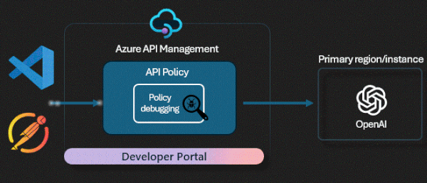](labs/developer-tooling/developer-tooling.ipynb)  | [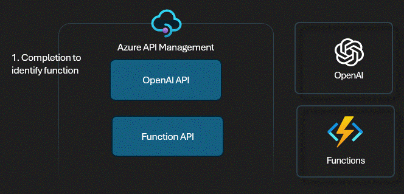](labs/function-calling/function-calling.ipynb) |
| Azure API Management で利用可能な開発者ツールを試して、AI Service API を開発、デバッグ、テスト、公開するための プレイグラウンド。 | Azure API Management によって管理される Azure Functions API で OpenAI [関数呼び出し](https://learn.microsoft.com/en-us/azure/ai-services/openai/how-to/function-calling?tabs=non-streaming%2Cpython) 機能を試すためのプレイグラウンド。  |
| [🦾 Bicep](labs/developer-tooling/main.bicep) ➕ [⚙️ Policy](labs/developer-tooling/policy.xml) ➕ [🧾 Notebook](labs/developer-tooling/developer-tooling.ipynb) 🟰 [💬](../../issues/35 "Feedback loop discussion") | [🦾 Bicep](labs/function-calling/main.bicep) ➕ [⚙️ Policy](labs/function-calling/policy.xml) ➕ [🧾 Notebook](labs/function-calling/function-calling.ipynb) 🟰 [💬](../../issues/36 "Feedback loop discussion") |
|  |  |
|  |  |
| [**🧪 Model Routing**](labs/model-routing/model-routing.ipynb) | [**🧪 Prompt flow**](labs/prompt-flow/prompt-flow.ipynb) |
| [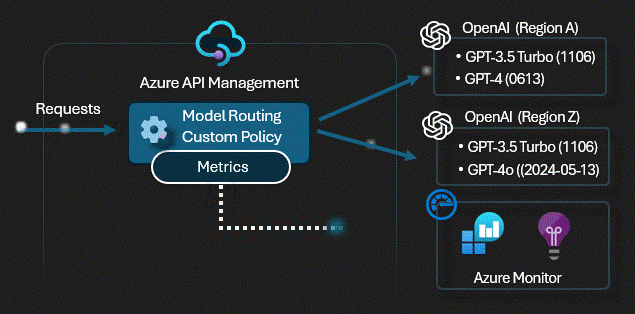](labs/model-routing/model-routing.ipynb)  | [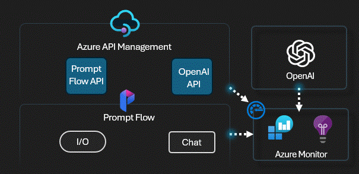](labs/prompt-flow/prompt-flow.ipynb) |
| Azure OpenAI モデルとバージョンに基づいてバックエンドへのルーティングを試すためのプレイグラウンド。 | Azure API Management で [Azure AI Studio プロンプト フロー](https://learn.microsoft.com/en-us/azure/ai-studio/how-to/prompt-flow) を試すためのプレイグラウンド。 |
| [🦾 Bicep](labs/model-routing/main.bicep) ➕ [⚙️ Policy](labs/model-routing/policy.xml) ➕ [🧾 Notebook](labs/model-routing/model-routing.ipynb) 🟰 [💬](../../issues/37 "Feedback loop discussion") | [🦾 Bicep](labs/prompt-flow/main.bicep) ➕ [⚙️ Policy](labs/prompt-flow/policy.xml) ➕ [🧾 Notebook](labs/prompt-flow/prompt-flow.ipynb) 🟰 [💬](../../issues/38 "Feedback loop discussion") |
|  |  |
|  |  |
| [**🧪 Content Filtering**](labs/content-filtering/content-filtering.ipynb) | [**🧪 Prompt Shielding**](labs/content-filtering/prompt-shielding.ipynb) |
| [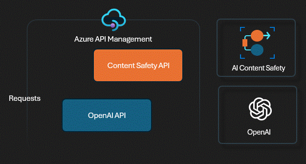](labs/content-filtering/content-filtering.ipynb)  |  |
| Azure API Management を [Azure AI Content Safety](https://learn.microsoft.com/en-us/azure/ai-services/content-safety/overview) と統合して、潜在的に不快なコンテンツ、危険なコンテンツ、または望ましくないコンテンツをフィルタリングしてみるプレイグラウンド。 | Azure AI Content Safety サービスの Prompt Shields を試すためのプレイグラウンドでは、LLM 入力を分析し、敵対的入力の 2 つの一般的な種類であるユーザー プロンプト攻撃とドキュメント攻撃を検出します。 |
| [🦾 Bicep](labs/content-filtering/main.bicep) ➕ [⚙️ Policy](labs/content-filtering/content-filtering-policy.xml) ➕ [🧾 Notebook](labs/content-filtering/content-filtering.ipynb) 🟰 [💬](../../issues/52 "Feedback loop discussion") | [🦾 Bicep](labs/content-filtering/main.bicep) ➕ [⚙️ Policy](labs/content-filtering/prompt-shield-policy.xml) ➕ [🧾 Notebook](labs/content-filtering/prompt-shielding.ipynb) 🟰 [💬](../../issues/53 "Feedback loop discussion") |
|  |  |

## 🚀 まず始めに

### Prerequisites

* [Python 3.8 or later version](https://www.python.org/) installed
* [VS Code](https://code.visualstudio.com/) installed with the [Jupyter notebook extension](https://marketplace.visualstudio.com/items?itemName=ms-toolsai.jupyter) enabled
* [Azure CLI](https://learn.microsoft.com/en-us/cli/azure/install-azure-cli) installed
* [An Azure Subscription](https://azure.microsoft.com/en-us/free/) (Contributor 以上のロール)
* [Access granted to Azure OpenAI](https://aka.ms/oai/access) or just enable the mock service
* [Sign in to Azure with Azure CLI](https://learn.microsoft.com/en-us/cli/azure/authenticate-azure-cli-interactively)

### クイックスタート

1. このリポジトリをクローンし、前提条件を使用してローカル コンピューターを構成します。または、[GitHub Codespace](https://codespaces.new/Azure-Samples/AI-Gateway/tree/main)を作成し、ブラウザまたはVSCodeで実行します。
2. 利用可能なラボをナビゲートし、ニーズに最も適したラボを選択します。手始めに、[バックエンドプールの負荷分散](labs/backend-pool-load-balancing/backend-pool-load-balancing.ipynb)をお勧めします。
3. ノートブックを開き、提供された手順を実行します。

## 🔨 ツール

* [AI-Gateway Mock server](tools/mock-server/mock-server.ipynb) は、OpenAI API の動作と応答を模倣するように設計されているため、Azure API Management やその他のユース ケースとの統合に関するテストおよび開発目的に適した効率的なシミュレーション環境が作成されます。[app.py](tools/mock-server/app.py) をカスタマイズして、モックサーバーを特定のユースケースに合わせて調整できます。
* [Tracing](tools/tracing.ipynb) - トレースを有効にして OpenAI API を呼び出し、トレース情報を返します。
* [Streaming](streaming.ipynb) - ストリームを有効にして OpenAI API を呼び出し、応答をチャンクで返します。

## 🏛️ Well-Architected Framework

[Azure Well-Architected Framework](https://learn.microsoft.com/en-us/azure/well-architected/what-is-well-architected-framework) は、ワークロードの品質を向上させることができる設計フレームワークです。次の表は、Well-Architected Framework の柱を持つラボをマッピングし、アーキテクチャの実験を通じて成功するための準備を整えています。

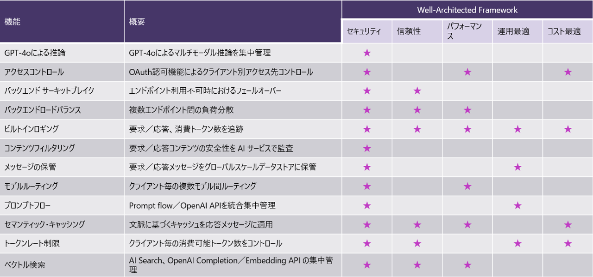

## 🥇 その他のリソース

このトピックでは、多数のリファレンスアーキテクチャ、ベストプラクティス、およびスターターキットを利用できます。包括的なソリューションやプロジェクトを開始するためのランディングゾーンが必要な場合は、提供されているリソースを参照してください。AI-Gateway ラボを活用して、リファレンス アーキテクチャに統合できる追加の機能を見つけることをお勧めします。

* [AI Hub Gateway Landing Zone](https://github.com/Azure-Samples/ai-hub-gateway-solution-accelerator)
* [GenAI Gateway Guide](https://aka.ms/genai-gateway)
* [Azure OpenAI + APIM Sample](https://aka.ms/apim/genai/sample-app)
* [AI+API better together: Benefits & Best Practices using APIs for AI workloads](https://techcommunity.microsoft.com/t5/apps-on-azure-blog/ai-api-better-together-benefits-amp-best-practices-using-apis/ba-p/4157120)
* [Designing and implementing a gateway solution with Azure OpenAI resources](https://aka.ms/genai-gateway)
* [Azure OpenAI Using PTUs/TPMs With API Management - Using the Scaling Special Sauce](https://github.com/Azure/aoai-apim)
* [Manage Azure OpenAI using APIM](https://github.com/microsoft/AzureOpenAI-with-APIM)
* [Setting up Azure OpenAI as a central capability with Azure API Management](https://github.com/Azure/enterprise-azureai)
* [Introduction to Building AI Apps](https://github.com/Azure/intro-to-intelligent-apps)